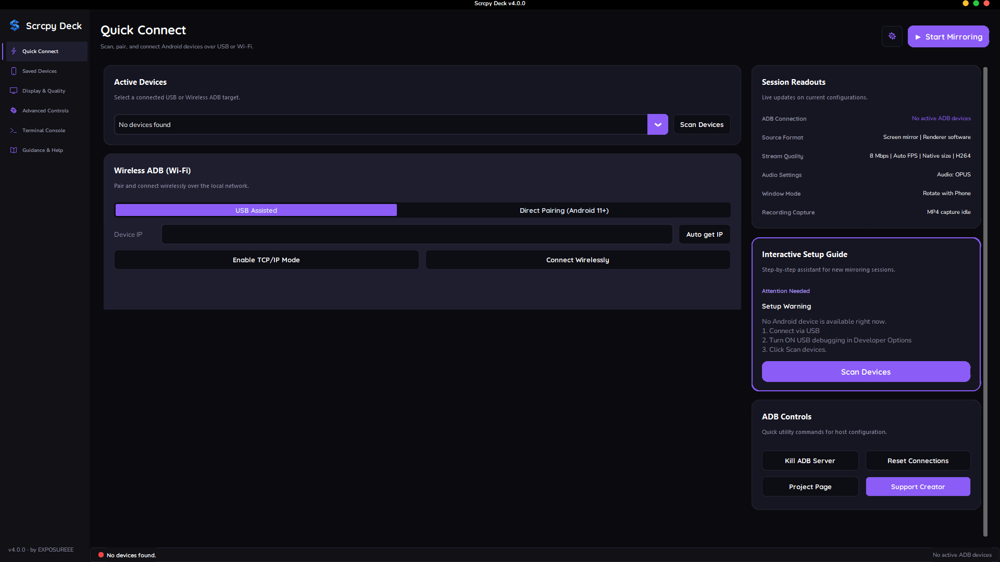

# Scrcpy Deck

Scrcpy Deck is a high-performance, cross-subsystem graphical control deck and management interface for Genymobile's [scrcpy](https://github.com/Genymobile/scrcpy) and the Android Debug Bridge (ADB). Engineered in Python and CustomTkinter, Scrcpy Deck eliminates the friction of command-line flag assembly while preserving low-latency screen mirroring, bi-directional input simulation, camera streaming, and device administration.

<p align="center">
  
</p>

---

## Technical Overview

Scrcpy Deck bridges high-level desktop user interactions with low-level Android hardware execution pipelines. The application orchestrates headless ADB daemon communication, handles non-blocking multi-process streaming, manages hardware discovery via mDNS, and provides real-time diagnostic stream telemetry.

### Core Architectural Highlights

- **Asynchronous Execution Architecture**: All ADB queries, process monitoring loops, and stream handlers run on isolated background threads, ensuring an unblocked 60 FPS graphical interface.
- **Hardware-Aware Device Identification**: Integrates deep Android property inspection (`getprop`) across OEM subsystems (Samsung, Xiaomi/HyperOS, OnePlus, Oppo/ColorOS, Vivo, Realme, Motorola) alongside a hardware mapping database to resolve opaque serial identifiers into precise marketing designations.
- **Dynamic mDNS and Wireless Pairing**: Supports both traditional USB-assisted TCP/IP switching and Android 11+ dynamic TLS pairing protocols (`adb pair` and `adb connect`) with automated port resolution.
- **Multi-Sensor Camera Subsystem**: Exposes Android 12+ camera streaming pipelines with physical sensor discovery (`--list-cameras`), lens selection, aspect ratio enforcement, torch toggling, digital zoom, and real-time resolution constraints.
- **Direct Input & OTG Modes**: Supports standard HID injection over mirroring protocols as well as pure USB OTG emulation (`--otg`) for physical keyboard/mouse pass-through without display rendering overhead.
- **Diagnostic Engine and Telemetry**: Captures standard output and error descriptors in real time, classifying logs into severity streams with an integrated heuristic engine that delivers contextual remediation steps for connection and encoding faults.

---

## Feature Matrix

| Category | Capability | Description |
| :--- | :--- | :--- |
| **Connectivity** | USB Auto-Discovery | Real-time device polling, state resolution (device, unauthorized, offline), and automatic property extraction. |
| | USB-Assisted Wi-Fi | Automated local WLAN IP extraction via `ip -f inet addr show wlan0` and port 5555 TCP/IP promotion. |
| | Android 11+ Wireless Pairing | Native pairing code and ephemeral port negotiation with mDNS service discovery (`_adb-tls-connect._tcp`). |
| | Saved Devices & Auto-Recovery | Persistent device cache with custom nicknaming and automated USB-assisted IP re-synchronization. |
| **Display Pipeline** | Bitrate & Framerate | Fine-grained video bitrate allocation (1 to 64 Mbps) and frame capping (Auto, 30, 60, 120 FPS). |
| | Resolution Scaling | Dynamic downscaling and maximum size boundary enforcement (e.g., 720p, 1080p, 1440p, 2560px). |
| | Video Codecs | Support for H.264 (AVC), H.265 (HEVC), and AV1 hardware-accelerated encoding pipelines. |
| | Render Drivers | Configurable rendering backends: Direct3D, OpenGL, Metal, and Software fallback. |
| | Orientation Controls | Dynamic sync with device orientation or locked aspect enforcement (Portrait @0, Landscape @90, Inverted). |
| **Audio Subsystem** | Audio Forwarding | Real-time audio streaming via Opus, AAC, or uncompressed RAW PCM buffers (Android 11+). |
| | Dedicated Microphone Mode | Headless audio forwarding using Android device as an external microphone input (`--no-video --audio-source=mic`). |
| | Hardware Audio Mute | Option to suppress audio capture while retaining full visual streaming. |
| **Camera & Capture** | Sensor Selection | Direct identification and targeting of discrete physical lenses (wide, ultra-wide, telephoto, front). |
| | Camera Tuning | Aspect ratio locking (Sensor, 4:3, 16:9), optical/digital zoom factors, orientation, and flash/torch activation. |
| | Session Recording | Lossless stream recording directly to timestamped MP4 containers (`recording_YYYYMMDD_HHMMSS.mp4`). |
| **Hardware & Window** | Power & Screen States | Prevent host/device sleep (`--stay-awake`), physical screen blanking (`--turn-screen-off`), and touch visualization. |
| | Window Framing | Borderless windowing, true fullscreen display, and always-on-top desktop pinning. |
| | Input Modes | Full keyboard/mouse control, read-only display mode (`--no-control`), and OTG hardware input mode. |
| **Diagnostics** | Embedded Terminal | Direct command execution environment within the project workspace supporting PowerShell, ADB, and Scrcpy CLI. |
| | Heuristic Fix Hints | Automated error analysis engine identifying authorization locks, driver collisions, and port bindings. |
| | ADB State Reset | Single-click local daemon termination, endpoint disconnects, and ADB key revocation (`~/.android/adbkey`). |

---

## System Requirements

### Host Environment (Desktop)
- **Operating System**: Windows 10 or Windows 11 (64-bit).
- **Runtime Dependencies**: Python 3.10+ (if running from source).
- **Graphics Support**: DirectX 11 / OpenGL 3.0 capable GPU (for hardware-accelerated video decoding).
- **USB Subsystem**: USB 2.0 interface minimum (USB 3.0+ recommended for high-bitrate screen and camera streaming).

### Client Environment (Android Device)
- **Minimum Android Version**:
  - Android 5.0 (Lollipop) for basic screen mirroring.
  - Android 10.0 (Q) for audio forwarding.
  - Android 11.0 (R) for native wireless pairing without prior USB connection.
  - Android 12.0 (S) for camera streaming capabilities.
- **Developer Settings**:
  - `Developer Options` enabled.
  - `USB Debugging` enabled.
  - `Wireless Debugging` enabled (for cord-free operations).
  - OEM-specific permissions (e.g., `USB debugging (Security settings)` on Xiaomi / HyperOS / MIUI devices).

---

## Installation & Deployment

### Method 1: Windows Installer (Recommended for End Users)

1. Download the latest `scrcpy-deck-<version>-setup.exe` from the [Releases](https://github.com/xosmos01-cyber/Scrcpy-GUI-by-EXPOSUREEE/releases) page.
2. Execute the installer. The installer automatically:
   - Deploys the standalone executable and bundled assets.
   - Bundles required SDL2, SDL3, FFmpeg (`avcodec`, `avformat`, `avutil`, `swresample`), and LibUSB runtime binaries.
   - Installs the Universal ADB Driver package silently in the background if driver interfaces are absent.
3. Launch **Scrcpy Deck** from the Start Menu or Desktop shortcut.

### Method 2: Running from Source

Clone the repository and configure a dedicated virtual environment:

```bash
# Clone the repository
git clone https://github.com/xosmos01-cyber/Scrcpy-GUI-by-EXPOSUREEE.git
cd Scrcpy-GUI-by-EXPOSUREEE

# Initialize and activate Python virtual environment
python -m venv venv
venv\Scripts\activate

# Install required Python dependencies
pip install customtkinter pillow
```

Ensure that `adb.exe`, `scrcpy.exe`, `scrcpy-server`, and required runtime DLLs reside in the root directory (or are globally available on your system `PATH`).

Execute the application entry point:

```bash
python main.py
```

---

## Operational Workflows

### 1. Wired USB Mirroring
1. Connect your Android device to the PC using a verified data-capable USB cable.
2. Ensure `USB Debugging` is active on your device and accept the RSA host authorization prompt when prompted.
3. Open Scrcpy Deck and navigate to **Quick Connect**.
4. Click **Scan Devices**. Select your target from the **Active Devices** menu.
5. Click **Start Mirroring** in the header action bar.

### 2. USB-Assisted Wireless Connection
1. Connect the device via USB initially.
2. Under **Quick Connect** > **Wireless ADB (Wi-Fi)**, select the **USB Assisted** mode tab.
3. Click **Auto get IP** to query the local `wlan0` interface address.
4. Click **Enable TCP/IP Mode** to instruct the on-device ADB daemon to listen on port 5555.
5. Click **Connect Wirelessly**. Once confirmed, disconnect the USB cable and click **Start Mirroring**.

### 3. Android 11+ Direct Wireless Pairing (No USB Required)
1. Ensure the desktop PC and Android device reside on the same Wi-Fi subnet.
2. On the device, navigate to `Settings` > `Developer Options` > `Wireless Debugging` > `Pair device with pairing code`.
3. In Scrcpy Deck, select **Direct Pairing (Android 11+)**.
4. Enter the displayed IP address, ephemeral Pair Port, and 6-digit Wi-Fi Pairing Code, then click **Pair Device**.
5. Read the main connect port displayed on the device's Wireless Debugging root screen (or click **Auto-detect** via mDNS), input it into **Connect Port**, and click **Connect**.

### 4. High-Resolution Camera Streaming
1. Open **Advanced Controls** (or the quick settings dialog via the gear icon).
2. Set **Mirror Source** to `Back Camera` or `Front Camera`.
3. In **Scrcpy Camera Options**, select your target lens ID, desired sensor aspect ratio (e.g., `16:9`), and frame rate limit.
4. Optional: Enable **Camera Torch** for hardware illumination or adjust **Camera Zoom**.
5. Click **Start Mirroring** to launch the camera feed without audio overhead.

### 5. Pure OTG Peripheral Emulation
1. Open **Quick Settings** (gear icon) and switch to the **Screen** tab.
2. Under **Connection Mode**, toggle **OTG (Control Only)**.
3. Click **Apply & Close** and initiate the session. The desktop keyboard and mouse will control the Android device as native USB HID input devices without video capturing or decoding.

---

## Project Structure

```
Scrcpy-Deck/
├── assets/                       # UI visual assets, logos, and application icons
├── data/
│   └── device_name_map.json      # OEM vendor-to-marketing name translation table
├── fonts/                        # Bundled typography (Cascadia Code, Nunito, Quicksand)
├── adb.py                        # ADB process wrapper, mDNS resolver, and key manager
├── assets.py                     # Asset loader, dynamic PIL vector icon generator
├── build_exe.py                  # PyInstaller build automation script
├── config.json                   # Saved user configuration and persistent device registry
├── config.py                     # Configuration state bindings and persistence layer
├── console.py                    # Real-time console manager and heuristic fault engine
├── device_names.py               # Android hardware property parser and formatter
├── main.py                       # High-DPI bootstrapping and application entry point
├── scrcpy_command.py             # Scrcpy CLI argument synthesis pipeline
├── ui.py                         # CustomTkinter GUI layout, views, and modal controllers
├── Scrcpy_GUI_Installer.iss      # Inno Setup compiler script for Windows distribution
├── Scrcpy_GUI_Pro_Final.spec     # PyInstaller single-file build specification
└── LICENSE                       # Project distribution license (GPL-3.0)
```

---

## Compilation & Packaging

### Compiling Executable via PyInstaller

To bundle the application into a standalone Windows binary:

```bash
python build_exe.py
```

The output executable will be compiled to `dist/Scrcpy_GUI_Pro.exe`.

### Generating Inno Setup Installer

1. Download and install [Inno Setup 6](https://jrsoftware.org/isdl.php).
2. Compile the executable using `build_exe.py`.
3. Open `Scrcpy_GUI_Installer.iss` in Inno Setup Compiler.
4. Click **Build** > **Compile**. The packaged setup binary will be generated in `installer_output/`.

---

## Troubleshooting & Diagnostics

### Common Diagnostic Remediation

- **Device Unauthorized (`unauthorized`)**:
  - Unlock the Android device.
  - Check for the "Allow USB debugging?" dialog on the phone screen and tap "Always allow from this computer".
  - If the prompt does not appear, navigate to **Quick Connect** > **ADB Controls** and click **Reset Connections** to regenerate host RSA keypairs.

- **ADB Daemon / Port Conflicts (`cannot connect to daemon`)**:
  - Third-party emulators or vendor suites (e.g., Samsung Smart Switch, BlueStacks) may hold locks on port 5037.
  - Click **Kill ADB Server** in the **ADB Controls** section, or execute `adb kill-server` inside the **Terminal Console**.

- **Dynamic IP Changes on Wireless Reconnect**:
  - When reconnecting to a saved device whose DHCP lease has changed, Scrcpy Deck triggers the **Auto-Recover** wizard.
  - Reconnect the phone via USB momentarily; the application will automatically query the new IP, rebind TCP/IP mode, update configuration records, and restore wireless connectivity.

- **Capture or Encoding Initialization Failures**:
  - High-resolution streams may exceed hardware encoder limits on older mobile chipsets.
  - Navigate to **Display & Quality** and reduce **Max Resolution Size** to `1080` or `720`, switch the **Video Codec** to `h264`, or lower the **Stream Bitrate**.

---

## Contributing

Contributions to improve compatibility across Android variants, optimize rendering pipelines, or extend GUI features are welcome.

1. Fork the repository.
2. Create a feature branch: `git checkout -b feature/enhancement-name`.
3. Commit your changes following clean code conventions: `git commit -m "feat: implement feature description"`.
4. Push the branch: `git push origin feature/enhancement-name`.
5. Open a Pull Request detailing the changes and verification steps.

---

## License & Acknowledgments

- **License**: Distributed under the [GNU General Public License v3.0](LICENSE).
- **Core Engine**: Powered by [Genymobile/scrcpy](https://github.com/Genymobile/scrcpy).
- **Bridge Tooling**: Powered by the Android Open Source Project (AOSP) ADB utilities.
- **UI Framework**: Built with [CustomTkinter](https://github.com/TomSchimansky/CustomTkinter) by Tom Schimansky.
